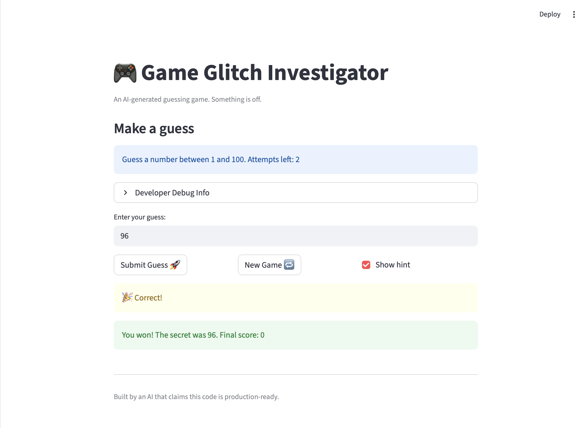

# 🎮 Game Glitch Investigator: The Impossible Guesser

## 🚨 The Situation

You asked an AI to build a simple "Number Guessing Game" using Streamlit.
It wrote the code, ran away, and now the game is unplayable. 

- You can't win.
- The hints lie to you.
- The secret number seems to have commitment issues.

## 🛠️ Setup

1. Install dependencies: `pip install -r requirements.txt`
2. Run the broken app: `python -m streamlit run app.py`

## 🕵️‍♂️ Your Mission

1. **Play the game.** Open the "Developer Debug Info" tab in the app to see the secret number. Try to win.
2. **Find the State Bug.** Why does the secret number change every time you click "Submit"? Ask ChatGPT: *"How do I keep a variable from resetting in Streamlit when I click a button?"*
3. **Fix the Logic.** The hints ("Higher/Lower") are wrong. Fix them.
4. **Refactor & Test.** - Move the logic into `logic_utils.py`.
   - Run `pytest` in your terminal.
   - Keep fixing until all tests pass!

## 📝 Document Your Experience

- [x] Describe the game's purpose.
The game challenges players to guess a secret number within a limited number of attempts. Difficulty settings control the number range and attempt limit.
- [x] Detail which bugs you found.
Hints were incorrect (“Higher” shown when guess was actually lower).
Secret number and scores reset unexpectedly due to Streamlit reruns.
Score updates were inconsistent and history did not always reset on a new game.
- [x] Explain what fixes you applied.
Refactored check_guess, parse_guess, and update_score into logic_utils.py.
Used st.session_state to persist the secret number, attempts, score, and history.
Corrected conditional logic in check_guess so hints now match guesses.
Added pytest cases to confirm high/low/correct outcomes and score updates.

## 📸 Demo

- [x] [Insert a screenshot of your fixed, winning game here]

## 🚀 Stretch Features

- [ ] [If you choose to complete Challenge 4, insert a screenshot of your Enhanced Game UI here]
